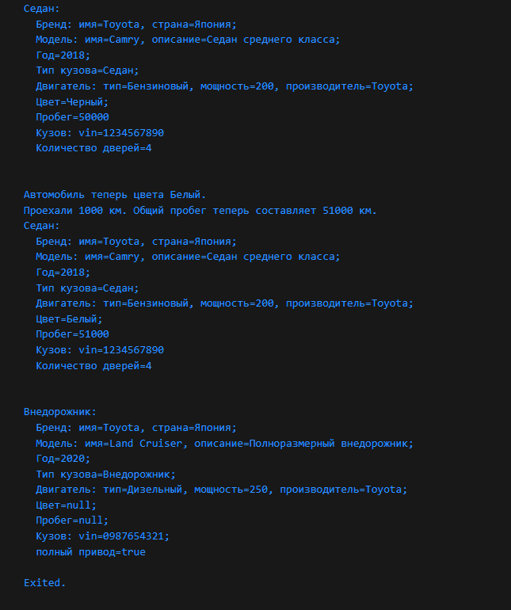

# Проект V2. Объект из реальной жизни

## Оглавление
[1. Описание проекта](README.md#Описание-проекта) 
[2. Входные данные](README.md#Входные-данные)  
[3. Как решал?](README.md#Как-решал?)    
[4. Результаты](README.md#Результаты)  
[5. Выводы](README.md#Выводы)

### Описание проекта
Скрипт для описания модели автомобиля с помощью классов на языке Dart

### Результаты

### Вывод:

К конце можно можно сделать небольшой вывод:

✅ Поставленный кейс выполнил;
 ✅ Были закреплены полученные знания;